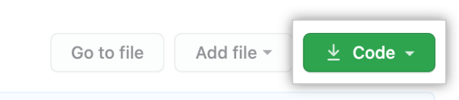
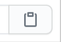
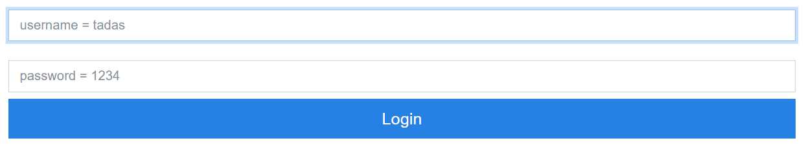
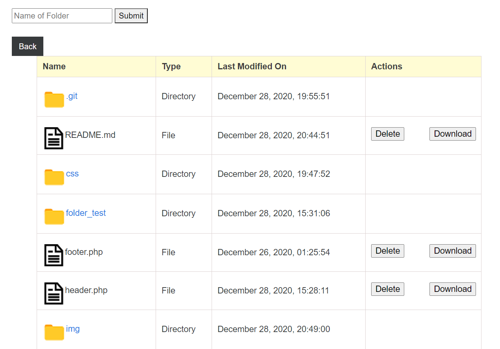
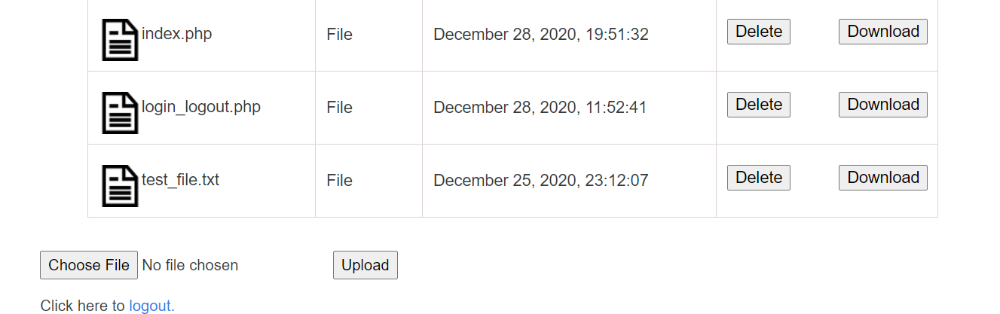

# File Browser


Server file browser built with PHP.

  :eyes: User can see the list of folders and files inside a directory <br>
  :file_folder: User can create new folders or delete files <br>
  :back: User can move from folder to folder <br>
  :clock1230: User can see when the file/folder was modified <br>
  :heavy_plus_sign: User can upload and download new files <br>
  :white_check_mark: User can login and logout <br>
---

## Installation


In order to run the project you need to have AMPPS installed. When you have it just add the project folder to your AMPPS projects directory ("../Ampps/www/"). Then open the directory via localhost.<br>

### Cloning a repository

- On GitHub, navigate to the main page of the repository.
- Above the list of files, click  Code.


- To clone the repository using HTTPS, under "Clone with HTTPS", click this: <br>


- Open Git Bash.
- Change the current working directory to the location where you want the cloned directory.
- Type ``` git clone ```, and then paste the URL you copied earlier.

```bash
# $ git clone https://github.com/iltoeeai/File-System-Browser.git
```
- Press Enter to create your local clone.
___

## Login details


- :man: username: **tadas**
- :unlock: password: **1234**
___

### Screenshots

<div>
    
    
    
</div>
___